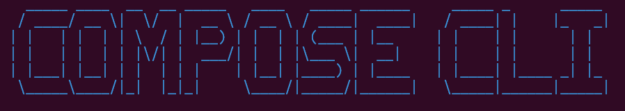

`@perfect-abstractions/compose-cli` scaffolds Compose-based facet diamond projects.

## Install

```bash
npm install -g @perfect-abstractions/compose-cli
```

## Commands

```bash
compose init
compose list-templates
compose --version
compose update
```

### Non-interactive examples

```bash
compose init --name my-foundry-app --template default --framework foundry --yes
compose init --name my-hardhat-js --template default --framework hardhat --language javascript --skip-install --yes
compose init --name my-hardhat-ts --template default --framework hardhat --language typescript --install-deps --yes
```

## Notes on `@perfect-abstractions/compose`

Hardhat scaffolds inject `@perfect-abstractions/compose` as the dependency name now.  

If package installation fails before publication, the scaffold is still generated and you can retry install later.

## Scaffold variants

- `default-foundry`
- `default-hardhat-minimal`
- `default-hardhat-mocha-ethers`
- `default-hardhat-node-runner-viem`

## Development

```bash
npm install
npm run check
```

To build or test the foundry template (or any template that uses `lib/` submodules), init libs once:

```bash
npm run prepare:lib
```

Then from a template directory, e.g. `src/templates/default/foundry`, run `forge build` and `forge test`. New templates that need forge-std or Compose can add the same submodules under their own `lib/`; `prepare:lib` inits all submodules repo-wide.
